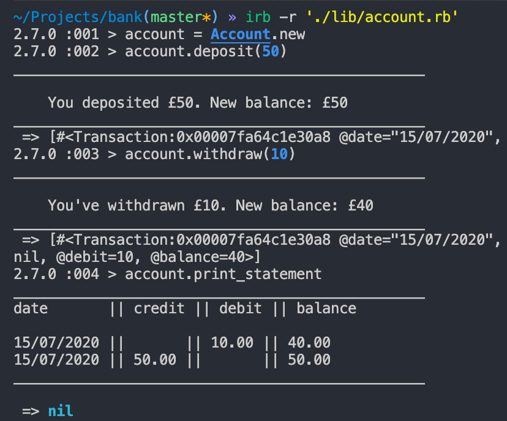

# Bank Tech Test


## Specification

### Requirements

- You should be able to interact with your code via a REPL like IRB or the JavaScript console. (You don't need to implement a command line interface that takes input from STDIN.)
- Deposits, withdrawal.
- Account statement (date, amount, balance) printing.
- Data can be kept in memory (it doesn't need to be stored to a database or anything).

### Acceptance criteria

**Given** a client makes a deposit of 1000 on 10-01-2012  
**And** a deposit of 2000 on 13-01-2012  
**And** a withdrawal of 500 on 14-01-2012  
**When** she prints her bank statement  
**Then** she would see

```
date || credit || debit || balance
14/01/2012 || || 500.00 || 2500.00
13/01/2012 || 2000.00 || || 3000.00
10/01/2012 || 1000.00 || || 1000.00
```

---

## Result



### User Stories

```
As a bank,
So I don't give away money,
I want every new bank account to start with a balance of 0
```

- [x] Done

```
As a bank account owner,
So I can store my money in a save place,
I want to be able to deposit money into my account
```

- [x] Done

```
As a bank account owner,
So I can use my hard-earned money to buy nice things,
I want to be able to withdraw money
```

- [x] Done

```
As a bank account owner,
So I know how much I stupidly spend on xmas drinks
I want to be able to see my current balance
```

- [x] Done

```
As a bank account owner,
So I don't spend money I don't have while being severely intoxicated
I don't want to be able to get into an unarranged overdraft
```

- [x] Done

```
As a bank account owner,
So I can remember the time I've lost all my savings on a bender
I want to be able to see the date of each transaction
```

- [x] Done

```
As a bank account owner,
So I can have proof for my settled-status application,
I want to be able to print my bank statements
```

- [x] Done

```
As a bank account owner,
So I don't lose money because of a typo
I don't want to be able to deposit a negative amount of money
```

- [x] Done
